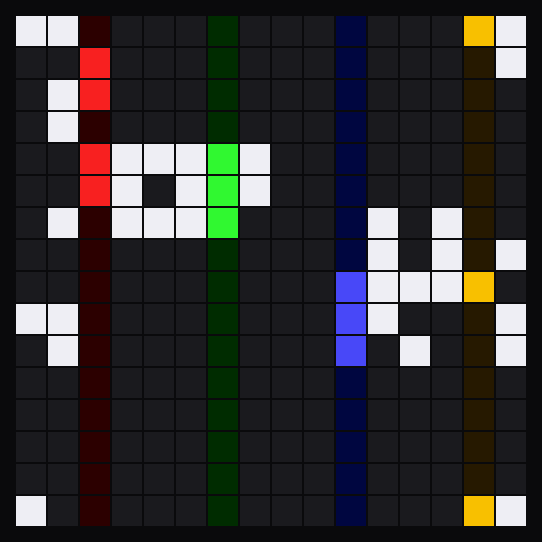

# plinky-life



A Game of Life sequencer panel for the [Plinky 12](https://plinky12.com), in the spirit of
[ZOA](https://apps.apple.com/us/app/zoa-living-midi-sequencer/id1581881354).

The 16×16 grid is a living palette, not a piano roll: **columns are steps, rows are scale
degrees**, and a Conway world rewrites the whole grid underneath you on its own clock. Four
independent voices walk through it at their own speeds, playing whatever they find alive.

**An empty column is a rest**, which is what turns the shape of the world into rhythm.

**→ [Manual](docs/manual.md)**: how to play it, with pad maps of every mode.

## Load it

**[`life.cpp`](https://raw.githubusercontent.com/charlesvestal/plinky-life/main/life.cpp)**: paste this into the Plinky IDE.
It runs on Blocks, Chords, Drums and Toadstep, and lays itself out to match whichever you have.

<details>
<summary><b>Building from source</b></summary>

```sh
sh tests.sh                  # everything checkable without hardware
sh harness/build.sh          # desktop tests for the pure logic
sh harness/compile_check.sh  # amalgamate, then type-check against stubbed headers
sh build/amalgamate.sh       # just produce life.cpp
python3 docs/make_maps.py    # regenerate the manual's pad maps
```

`src/panel.cpp` does not compile on its own: panel code cannot use `#include`, and the IDE injects
the SDK headers. `amalgamate.sh` splices the pure headers in ahead of it to produce the single
`life.cpp` that gets loaded.

`harness/plinky_stubs.h` mirrors the published API so the generated file can be type-checked on a
laptop rather than on the device. It is not the SDK, and where the two disagree the firmware is
right.

### Layout

```
src/life.h        Conway world, population stats, respawn trigger
src/selection.h   the 11 selection rules over a column
src/traversal.h   column order: forward, reverse, ping-pong, random
src/scales.h      29 scale masks, degree -> note
src/voice.h       note lifecycle, polyphony budget, one exit path
src/ccmap.h       the MIDI CC block, in and out, and its value scaling
src/chance.h      conditional triggers derived from the world
src/panel.cpp     clocks, output, drawing, touch, settings pages

harness/          desktop tests + stubbed headers for the compile check
build/            amalgamation into life.cpp
docs/             manual, generated pad maps, design spec
```

The seven headers are pure functions of plain data with no Plinky API in them, which is why they
run natively. The musical logic is proved on a laptop and `panel.cpp` is thin glue. Over 34,000
assertions cover the world, the selection rules, the scale tables and the note lifecycle.

The pad maps in the manual are generated from the same layout table the panel uses, and checked
against `panel.cpp` when they are built, so they match the pads. The editor pages have a map per
faceplate, since the layout differs on Chords and Drums.

### Design notes

`docs/superpowers/specs/` holds the design spec, including the deviations made during
implementation and why.

`SYSTEM_NOTES.md` is a general reference for Plinky 12 panel development: hardware, execution
model, memory and assorted gotchas. Not specific to this panel.

</details>

## Licence

MIT, see [`LICENSE`](LICENSE).

## Credits

Conway's Game of Life, by way of ZOA's idea of using it as a musical palette rather than a
visualisation.

## How this was built

This panel was built with help from coding agents like Claude, but with significant design,
oversight and hours from a human (me). If that's not to your taste, totally fine!
