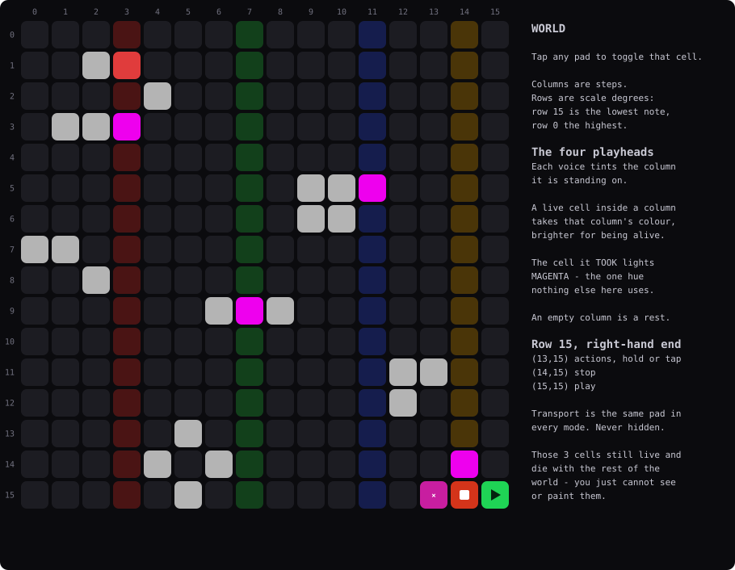
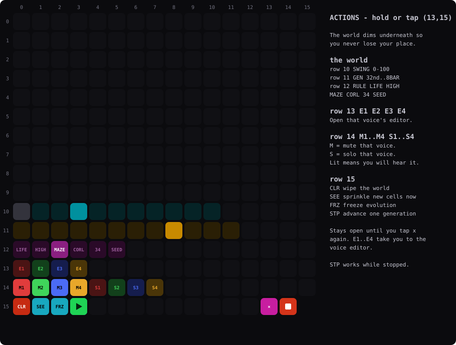
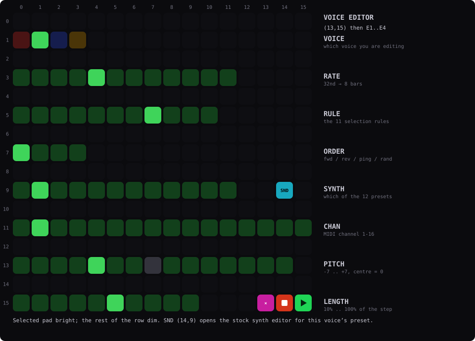
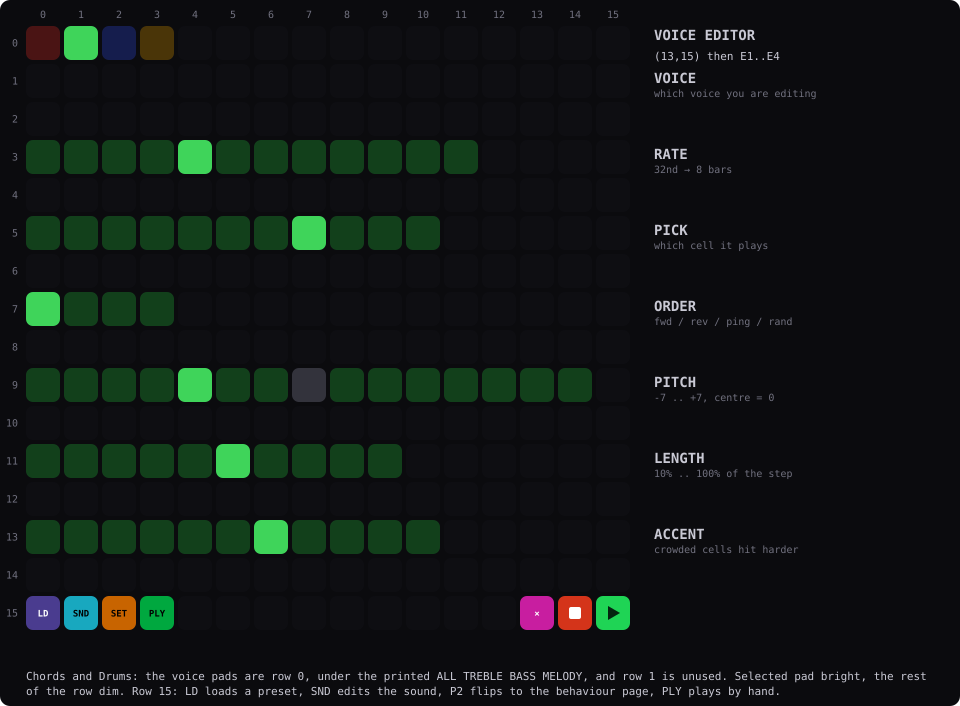
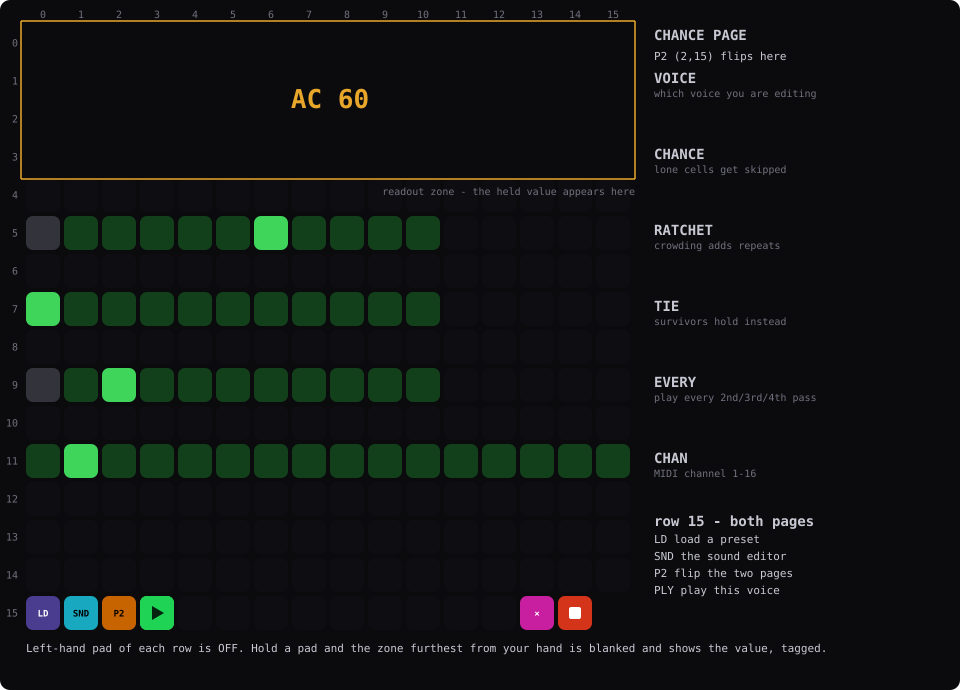
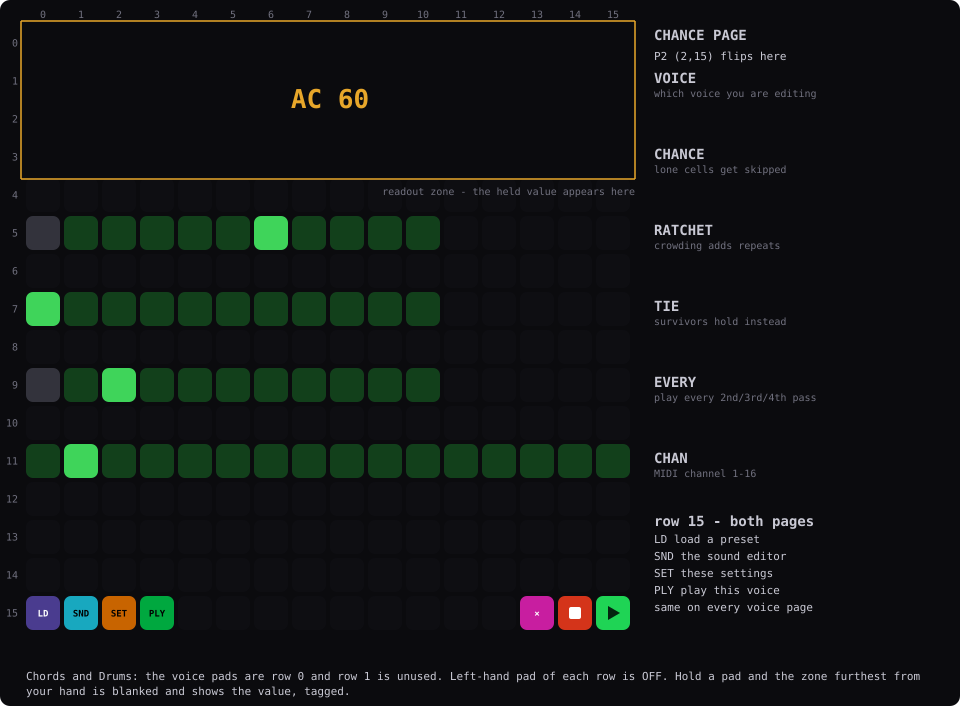
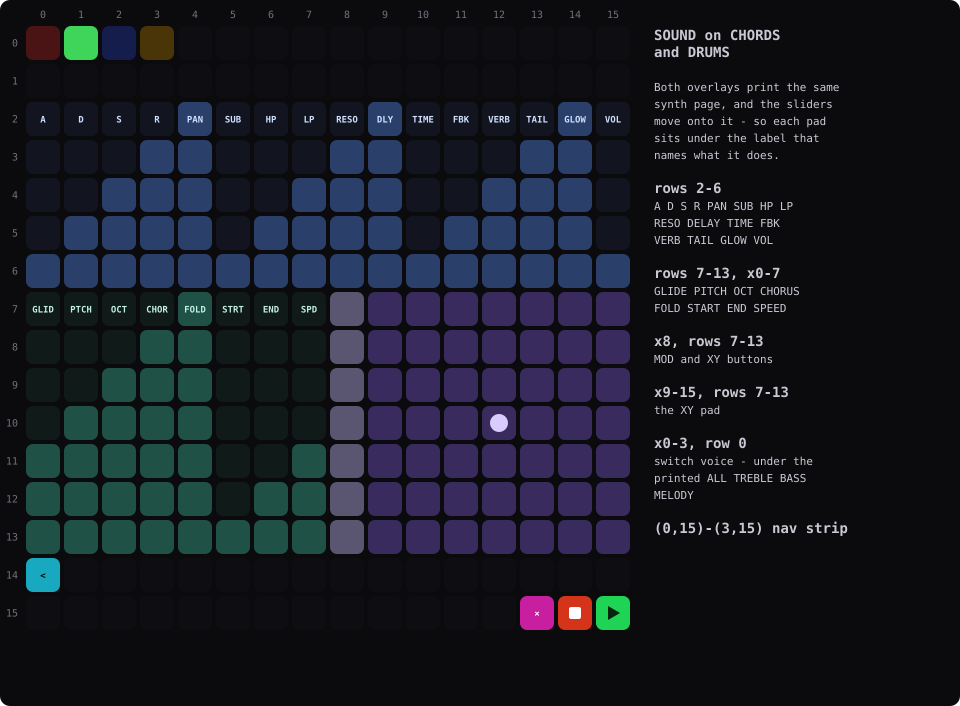
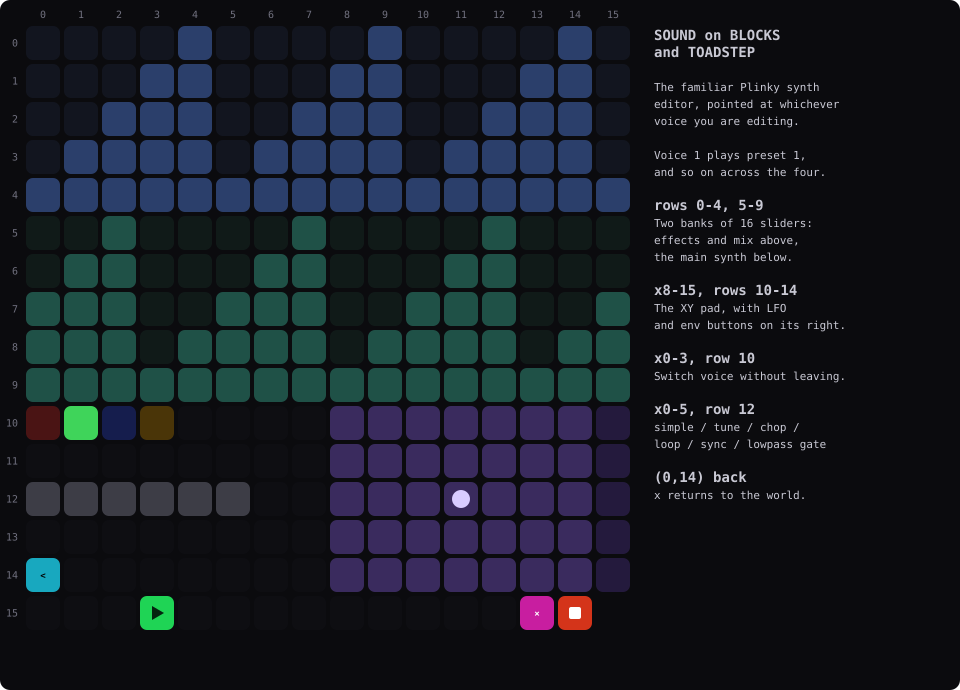

# Life

A Game of Life sequencer for the Plinky 12.

The 16×16 grid holds a Game of Life world that keeps evolving on its own clock.
Columns are steps and rows are scale degrees. Four voices walk through the world
at their own speeds and play whatever cells they find alive.

If a voice arrives at a column with nothing alive in it, it rests. That is what
gives the music its rhythm.

---

## Quick start

1. Press `(15,15)`, the green play pad in the bottom right corner.
2. Listen. A newly loaded panel seeds itself, so it makes sound straight away.
3. Tap pads to bring cells to life and disturb it.
4. Tap `(13,15)`, the magenta `×`, for mutes, solos and the voice editors.

Nothing moves while transport is stopped. No generations, no notes. The
exception is the step pad at `(3,15)`, which walks the world forward by hand.

---

## 1. The world

Every pad is a cell. Tap one to toggle it alive or dead.

Cells breed and die by Conway's rules. A cell with two or three live neighbours
survives, and an empty space with exactly three neighbours comes to life. The
grid wraps at the edges, so a pattern that drifts off one side reappears on the
other.

### Row 15

The bottom right corner follows the same layout as Chords, so the pads are where
you would expect:

| Pad | |
|---|---|
| `(12,15)` | unused, still part of the world |
| `(13,15)` | `×`, actions. Hold or tap. |
| `(14,15)` | ■ stop |
| `(15,15)` | ▶ play |

Transport works the same way in every mode. It is never hidden behind a modifier
and never changes meaning.

Three cells are given over to those pads. They still live and die with the rest
of the world, you just cannot see or paint them.

On the Chords and Drums overlays the world still uses all 16 rows, so the top and
bottom rows sit outside the printed pad circles. That is deliberate. Rows are
pitch, and cropping them would cost two scale degrees at each end. The sound page
does line up with the printed labels.

### Reading the playheads

Each voice tints the column it is standing on, in its own colour:

| | Voice |
|---|---|
| 🔴 | 1 |
| 🟢 | 2 |
| 🔵 | 3 |
| 🟡 | 4 |

A playhead sits over the world, so cells inside its column take the column's
colour and glow brighter for being alive. The dim tint is where the voice is,
the bright cells are what is alive there.

The cell a voice actually took lights **magenta**, which is the one colour
nothing else on the grid uses. Which voice took it is already answered by the
column it is standing in.

---

## 2. Actions

Tap `×` or hold it, either works. It stays open until you tap `×` again, so you
can audition rules, set up a mix or nudge swing without reopening it each time.
The world dims underneath so you do not lose your place.

The grid cannot show text, so these are coloured pads rather than labels.
Position and colour are what you learn. Each voice keeps its own colour on rows
13 and 14, red means destructive, cyan is for the world controls.

| Pads | | |
|---|---|---|
| `(0,10)`–`(10,10)` | swing | 0 to 100%, off at the left |
| `(0,11)`–`(11,11)` | generation rate | how often the world evolves |
| `(0,12)`–`(5,12)` | rule | which law the world lives by, listed below |
| `(0,13)`–`(3,13)` | edit | open that voice's editor |
| `(0,14)`–`(3,14)` | mute | lit means you will hear that voice |
| `(4,14)`–`(7,14)` | solo | silences the other three |

A muted voice keeps running, it just does not sound, so unmuting drops it back
into the pattern where it would have been rather than where it stopped.

| `(0,15)` | clear | every cell dies, the red one |
| `(1,15)` | seed | sprinkle new cells in right now |
| `(2,15)` | freeze | stop the world changing, glows red while frozen |
| `(3,15)` | step | advance exactly one generation |

The four edit pads are the one thing that takes you elsewhere.

The top three rows are the world's own controls: its feel, its tempo and its law.
None of them belongs to a particular voice, which is why they sit together here
rather than in a voice editor.

Row 12, left to right:

| Pad | | |
|---|---|---|
| `(0,12)` | `LIFE` | Conway. Gliders drifting through a sparse world |
| `(1,12)` | `HIGH` | HighLife. Shapes replicate, so it keeps regenerating |
| `(2,12)` | `MAZE` | Dense slow-churning corridors, good for drones |
| `(3,12)` | `CORL` | Coral. Grows slowly outward into thick shapes |
| `(4,12)` | `34` | Restless, never settles for long |
| `(5,12)` | `SEED` | Everything dies every step and explodes outward |

The lit pad is the current one, and each explains itself on the second screen.

Freeze and step are the composing tools. Freeze holds the world still so you can
write against a fixed set of cells, and step nudges it forward one generation at
a time so you can hunt for a shape you like. Step works even while stopped.

---

## 3. The voice editor

The voice pads sit on row 1 on a plain faceplate. On Chords and Drums they move
to row 0, under the printed ALL TREBLE BASS MELODY, and row 1 goes dark.

<b>Blocks and Toadstep</b>

<b>Chords and Drums</b>

`×` then one of the four edit pads.

One setting per row, with blank rows between them so it stays readable at arm's
length. The bright pad is the current value and the dim ones show how far the
range goes.

| Row | | |
|---|---|---|
| 1 | voice | which voice you are editing, tap to switch (blank plates only) |
| 3 | rate | `32nd · 16T · 16th · 8T · 8th · 4T · 1/4 · 1/2 · 1BAR · 2BAR · 4BAR · 8BAR` |
| 5 | pick | which live cell it takes, see [picking a cell](#5-picking-a-cell) |
| 7 | order | forward · reverse · ping-pong · random |
| 9 | pitch | −7 to +7 scale degrees, the dim centre pad is 0 |
| 11 | length | 10% to 100% of the step |
| 13 | accent | how much a crowded cell hits harder than a lone one |

Row 15 carries the same four pads on every per-voice page, so you can go
straight from the preset picker to the sound page without backing out first.
The one you are on is lit:

| Pad | |
|---|---|
| `(0,15)` | load a preset into this voice |
| `(1,15)` | edit this voice's sound |
| `(2,15)` | these settings, or tap again to flip the page |
| `(3,15)` | play this voice by hand |

Press `×` to go back to the world.

Touching any pad describes it on the second screen, so you can read what a pick
does before committing to it.

### Playing a voice by hand

`(3,15)` turns the grid into a keyboard for the selected voice, so you can play
over the sequence while it runs. Notes sound and nothing else happens: the world
is left alone, because the point is to perform over it rather than disturb it.

The surface is Plinky's own. Each of the sixteen columns is a string and pitch
runs up it, one scale degree per pad, with each string a degree above the one to
its left. It is the same span as the instrument's own play surface, and it plays
the way you already know: press for a note, slide along a string to bend, press
harder for more.

On Chords and Drums it sits on rows 2 to 13, so it lands on the printed pad
circles. On a plain faceplate it takes rows 0 to 14.

It is always in key. The scale and root come from the same place as everything
else, so it follows `KEY` and `SCAL` without being told.

`(2,15)` goes back to the voice editor, `×` goes back to the world.

### Rate is where the groove comes from

All four voices cross all 16 columns, so they only sound polyrhythmic if their
speeds differ. The defaults are 8th, quarter triplet, quarter and half for that
reason. Set all four the same and you get four voices marching in step, which is
rarely what you want.

### Voice 1 plays preset 1

Four voices, four sounds, straight across. To use a different patch, load it into
that voice's slot.

### The behaviour page

<b>Blocks and Toadstep</b>

<b>Chords and Drums</b>

`(2,15)` flips between the two voice pages in both directions. Row 15 is the same
everywhere.

Four behaviours, each off at the left-hand pad and turning up from there. One
control both switches a behaviour on and sets how hard it bites.

| Row | | |
|---|---|---|
| 1 | voice | which voice you are editing (blank faceplates only) |
| 3 | chance | how much lone cells get skipped |
| 5 | ratchet | how much a crowded cell repeats inside its step |
| 7 | tie | how often a cell that survived holds instead of striking again |
| 9 | every | play only every 2nd, 3rd or 4th crossing of the world |
| 11 | channel | MIDI channel 1 to 16 |

These read the cell the voice actually landed on rather than being drawn onto
steps. A cell with eight neighbours always fires and rolls, a lone cell gets
skipped. A cell that was already alive last generation can hold the previous note
instead of striking a new one, while a cell born this generation always strikes.

So a glider drifting through a voice's path changes its rhythm as it goes, and
what you see on the grid is what you hear. Turn ratchet up on a voice and watch
where the world is dense. That is where it will roll.

`every` is the one that is not about cells. It gives a voice a phrase longer than
a single crossing, which nothing else here does. Set two voices to different
values and they drift in and out of each other.

### Reading a value

These rows are pads with no numbers on them, so hold one and the value is spelled
out. It appears in the zone furthest from your hand, so holding something in the
top half shows it at the bottom and the other way round. That zone blanks while
you hold, which keeps the text clear of the pads underneath.

Numbers are tagged, because `30` on its own says nothing. You get `AC 60` or
`SK 30`:

| | |
|---|---|
| `SK` `RT` `TI` `EV` `CH` | chance · ratchet · tie · every · channel |
| `PT` `LN` `AC` | pitch · length · accent |

Values that already name themselves are left alone, so rate reads `8th`, pick
reads `WALK` and order reads `FWD`.

---

## 4. Sound

Voice editor, then `(1,15)`.

This is the Plinky synth editor you already know, pointed at the selected voice.
It reads your faceplate at boot and rearranges itself to match, so you never have
to tell it which overlay you have. The second screen names the layout you are
looking at.

<b>Chords and Drums</b>

Both overlays print the same synth page and the sliders move onto it, so every
pad sits under the label that names what it does.

| Area | |
|---|---|
| rows 2–6 | A · D · S · R · PAN · SUB · HP · LP · RESO · DELAY · TIME · FBK · VERB · TAIL · GLOW · VOL |
| rows 7–13, `x0–7` | GLIDE · PITCH · OCT · CHORUS · FOLD · START · END · SPEED |
| `x8`, rows 7–13 | the MOD and XY buttons |
| `x9–15`, rows 7–13 | the XY pad |
| `(0,0)`–`(3,0)` | switch voice, under the printed ALL TREBLE BASS MELODY |
| `(0,15)`-`(3,15)` | the shared nav strip; `(2,15)` returns to the voice editor |

<b>Blocks and Toadstep</b>

| Area | |
|---|---|
| rows 0–4 | 16 sliders: effects sends and the mix |
| rows 5–9 | 16 sliders: the main synth parameters |
| `x8–15`, rows 10–14 | the XY pad, with LFO and envelope buttons down its right edge |
| `(0,10)`–`(3,10)` | switch voice, the editor follows |
| `(0,12)`–`(5,12)` | simple · tune · chop · loop · sync · lowpass gate |
| `(0,15)`-`(3,15)` | the shared nav strip; `(2,15)` returns to the voice editor |

The column order here already matches Toadstep's printed faders. Blocks prints no
labels at all.

### Loading a preset

Voice editor, then `(0,15)`, opens the preset picker. Folders on the left, slots
on the right, save and load at `(12,14)` and `(13,14)`.

**Tapping a slot only previews it.** You hear it straight away, but the voice
keeps its old sound until you press **LOAD**. Leave without loading, or switch
to another voice, and the preview is discarded. Press **SAVE** to write the
voice's current sound into the selected slot.

On Chords and Drums the file grid sits on the printed pad circles and the two
buttons land under the printed SAVE and LOAD. Transport stays live here, and `×`
gets you out.

On those plates the four voice pads at `(0,0)`–`(3,0)` follow you nearly
everywhere: the preset picker, the voice editor, the sound page and the play
surface. The voice you are working on is always the same four pads in the same
place. The settings pages and the scene page are the exceptions; neither is
per-voice.

---

## 5. Picking a cell

Two separate things, worth keeping apart:

- **order** is which column a voice moves to next.
- **pick** is which live cell in that column actually sounds.

Neither is the world's **rule**, which is the law every cell lives by. Pick is per
voice, rule is the whole world.

Given the live cells in the column a voice has arrived at:

| Pick | Plays |
|---|---|
| `FRST` | the topmost live cell, the highest note |
| `LAST` | the bottommost, the lowest note |
| `UP` | climbs through the live cells, one per step |
| `DOWN` | descends through them |
| `UPDN` | climbs then falls back, without repeating the ends |
| `DNUP` | falls then climbs back |
| `RAND` | any live cell, evenly |
| `WALK` | the one closest in pitch to the last note, which gives smooth lines |
| `RISE` | the next one above the last note, wrapping to the bottom |
| `FALL` | the next one below, wrapping to the top |
| `ALL` | every live cell at once, the only one that makes chords |

`WALK` gives you melodies, `RAND` gives you sparkle and `ALL` gives you pads.
Mixing them across the four voices is most of the instrument.

### How many notes at once

Every pick except `ALL` plays one note per step, so four voices give you up to
four notes. `ALL` plays the whole column.

Life gives the sequencer eight of the synth's voices, and keeps four for the
play surface. Each voice you can hear is guaranteed one of
them, so a chord can never cut off a melody, and whatever is spare goes to the
voices playing `ALL`. Mute the other three and a single `ALL` voice gets all
eight to itself.

Sending to MIDI only lifts the ceiling, and chords go out whole.

A cell surrounded by neighbours hits harder than a lone one, so dense clusters
accent themselves. How much is each voice's accent setting.

---

## 6. Settings

The right side buttons page through them and the left side buttons change the
value. The second screen explains each page as you land on it.

| | | |
|---|---|---|
| `KEY ` `SCAL` `OCT ` | musical | key, scale, base octave |
| `GEN ` `RULE` `FLOR` `SEED` `STAB` | the world | tempo, law, and keeping it alive |
| `SWNG` `SWPT` | feel | swing amount and shuffle pattern |
| `OUT ` `PORT` | output | synth, MIDI or both, and which ports |
| `CC  ` `CIN ` `COUT` `CV  ` `NIN ` | control | CCs out and in, CV out, note input |

They run in that order, so the pages you set once are at the end and stay out of
your way.

Key and scale set the whole instrument's harmony rather than just this panel's,
so the rest of the Plinky follows along.

---

## 7. Saving

Press the right side button down from the world to reach the scene page. Folders
on the left, slots on the right, save and load at `(12,14)` and `(13,14)`, under
the printed labels on Chords and Drums.

A scene holds the world itself, every live cell, plus every voice's rate, pick,
order, channel, pitch, length, accent and mute, its whole behaviour page, and the
rule, the swing, the generation rate and the respawn settings. Load one back and
you get the same world and the same four voices.

Loading waits for the next generation step before it swaps, so a scene change
lands on the beat rather than halfway through one. With the transport stopped it
happens straight away.

The settings pages are separate. Key, scale, octave, output, ports and CCs are
preferences, along with CV and note input: saved automatically as you change them
and shared by every scene.

---

## 8. Rules, swing and drawing from a keyboard

The rule is the law the world lives by, and changing it changes what the panel
does. It is on row 12 of the action layer, and on the `RULE` settings page:

| | |
|---|---|
| `LIFE` | Conway. Gliders drifting through a sparse world |
| `HIGH` | HighLife. Shapes replicate, so it keeps regenerating |
| `MAZE` | Dense slow-churning corridors, good for drones |
| `CORL` | Coral. Grows slowly outward into thick shapes |
| `34` | Restless, never settles for long |
| `SEED` | Everything dies every step and explodes outward |

`SWNG` shuffles every voice together while the world keeps its own straight time.
It is on the action layer too. `SWPT` picks plain 16th swing or one of seven
shuffle patterns.

`NIN` lets you draw with a keyboard. Played notes become cells, one column per
note, left to right. Off-scale notes snap to the nearest degree, so it always
draws something.

`CV` sends the world out as voltage. A follows how full it is and B follows how
much is changing.

---

## 9. Keeping it alive

Left alone, a Game of Life world eventually settles into shapes that never
change, and a frozen world means four playheads walking a loop that never varies.
So Life watches for that and sprinkles new cells in.

- `FLOR` tops the world up when the population drops below this
- `SEED` is how many cells to add
- `STAB` is how many generations of nothing at all changing count as stuck

Blinking patterns still count as alive, so a world that is oscillating gets left
alone. It is still making music.

Set `FLOR` and `STAB` to 0 if you would rather let it die.

---

## 10. Output

Each voice has its own sound and its own MIDI channel, defaulting to channels 1
to 4. `OUT` chooses the internal synth, MIDI, or both.

### Controlling Life from a DAW

With `CIN` set, 30 by default, a block of 35 controllers on the system MIDI
channel drives the panel. Counting up from the base:

| Offset | |
|---|---|
| +0 | key |
| +1 | scale |
| +2 | octave |
| +3 | generation rate |
| +4 | respawn floor |
| +5 | respawn amount |
| +6 | stall limit |
| +7 | clear the world |
| +8 | seed now |
| +9 | freeze |
| +10 | step one generation |
| +11 … +14 | mute, voices 1–4 |
| +15 … +18 | rate, voices 1–4 |
| +19 … +22 | pick, voices 1–4 |
| +23 … +26 | order, voices 1–4 |
| +27 … +30 | pitch, voices 1–4 |
| +31 … +34 | length, voices 1–4 |

The per-voice controls are grouped by parameter, so a row of four knobs sets the
same thing on all four voices.

Clear, seed and step are momentary. They fire once when the value crosses halfway
going up, so a button that sends 127 then 0 fires once.

With `COUT` on it works both ways. Change something on the grid and the same
controller goes back out, so a DAW or a controller with motorised faders stays in
step. You can leave both on with everything on one channel, because an echo of
what Life sent decodes to the value it already holds, changes nothing and sends
nothing back.

### Simulation CCs out

With `CC` on, Life sends eight controllers describing the world itself, once per
generation:

| CC | |
|---|---|
| 20 | how full the world is |
| 21 | births this generation |
| 22 | deaths this generation |
| 23 | how still it is |
| 24–27 | how far each voice's last note moved |

They are only sent when a value actually changes, so a settled world goes quiet
rather than flooding the bus.

---

## 11. If something seems wrong

**Nothing plays.** Check transport is running. `(15,15)` glows bright green when
it is. Nothing moves while stopped.

**Still nothing.** Check `OUT` and `PORT`. `OUT` set to synth sends no MIDI, and
`PORT` off sends none either.

**One voice is silent.** Check its mute on row 14, and check whether another
voice is soloed. A solo anywhere silences the rest.

**It went static.** Either freeze at `(2,15)` is on, which glows red, or the
world got stuck and `FLOR` and `STAB` are too low to rescue it. Seed at `(1,15)`
adds cells immediately.

**It is too busy.** Lower `SEED`, slow `GEN` down, or mute a voice. Voices set to
`ALL` play chords and four of those at once is a lot.

**It sounds like one voice.** Give the four different rates. Same rate means same
rhythm.
